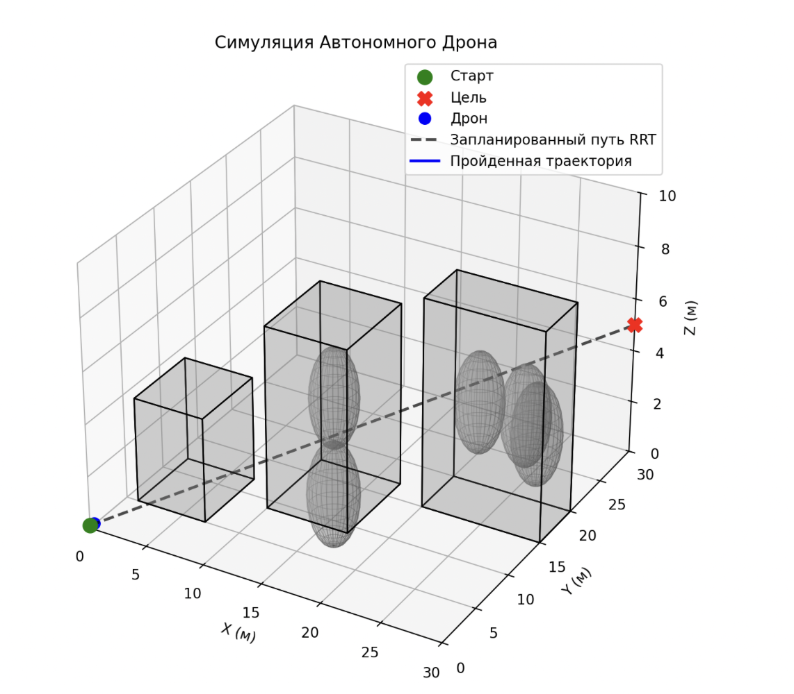

# Autonomous Drone Navigation with RRT and DWA

Гибридный алгоритм автономной навигации для беспилотного летательного аппарата (БПЛА) в неизвестной 3D-среде. Использует глобальное планирование (RRT) и локальное управление (DWA) для безопасного обхода препятствий.

---

## Основные особенности

### Двухуровневая архитектура планирования
1. **Глобальное планирование (RRT)**  
   - Строит маршрут с помощью модифицированного алгоритма RRT в 3D.  
   - Учитывает ограничения по высоте и препятствия.  
   - Сглаживание маршрута минимизирует лишние повороты и количество вейпоинтов.

2. **Локальное управление (DWA)**  
   - Движение в горизонтальной плоскости XY с контролем высоты Z.  
   - Оценка траекторий по направленности на цель, безопасности и скорости.  
   - Веса параметров настраиваются через конфигурационный файл.

3. **Координация планировщиков**  
   - Передача вейпоинтов из глобального планировщика в локальный.  
   - Автоматическое переключение на следующую точку маршрута.  
   - Обеспечивает непрерывное и адаптивное движение без внешнего вмешательства.
  
# Структура проекта

```plaintext
drone_autonomy_project/
├── main.py                    # Главный исполняемый файл проекта — точка входа приложения
├── config/
│   └── settings.py            # Конфигурационные параметры и настройки проекта
├── modules/
│   ├── data_structures/
│   │   ├── __init__.py        # Инициализация пакета data_structures
│   │   ├── obstacle.py        # Описание классов и структур препятствий
│   │   ├── path.py            # Классы и функции для работы с маршрутами дрона
│   │   └── point.py           # Описание точки в пространстве, вспомогательные структуры
│   ├── drone_state/
│   │   ├── __init__.py        # Инициализация пакета drone_state
│   │   ├── motion_model.py    # Моделирование движения дрона
│   │   └── state.py           # Определение и обработка состояния дрона
│   └── environment_sim/
│       ├── dynamic_obstacle_map.py    # Карта препятствий, построенная дроном на основе обнаруженных данных
│       ├── global_obstacles1.py       # Карта препятствий №1
│       ├── global_obstacles2.py       # Карта препятствий №2
│       └── radar_sensor.py            # Моделирование работы радара дрона
├── local_planning/
│   └── dwa_planner.py         # Локальный планировщик на основе DWA
├── path_planning/
│   ├── path_smoothing.py      # Функции сглаживания маршрута
│   ├── path_utils.py          # Вспомогательные функции для работы с маршрутами
│   └── rrt_planner.py         # Планировщик пути на основе алгоритма RRT
├── visualization/
│   └── plotter_3d.py          # 3D-визуализация данных и траекторий
└── utils/
    ├── __init__.py             # Инициализация пакета utils
    └── geometry_utils.py       # Геометрические утилиты и вспомогательные функции
```

       
